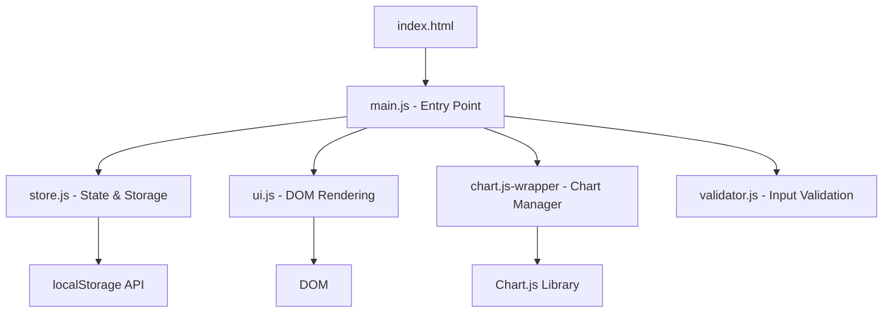
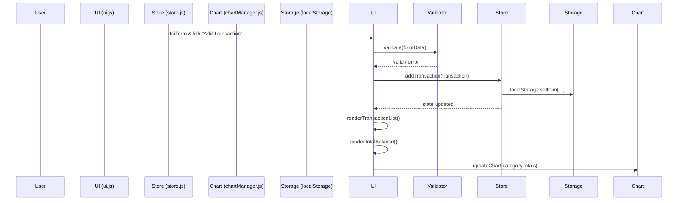

# Design Document

## Overview

Expense & Budget Visualizer adalah single-page web application (SPA) berbasis HTML, CSS, dan Vanilla JavaScript murni — tanpa framework frontend. Aplikasi ini memungkinkan pengguna mencatat transaksi pengeluaran, melihat total saldo, dan memvisualisasikan distribusi pengeluaran per kategori melalui pie chart interaktif.

Semua data disimpan di browser menggunakan Local Storage API sehingga tidak memerlukan backend. Chart.js digunakan sebagai library visualisasi untuk pie chart. Aplikasi dirancang mobile-first dan responsif dari 320px hingga 1440px.

Fitur inti (MVP) mencakup: input form, transaction list, total balance, pie chart, data persistence, responsive layout, dan visual design. Fitur opsional mencakup: dark/light mode toggle, monthly summary view, dan sort transactions.

---

## Architecture

Aplikasi menggunakan arsitektur **MVC-lite** berbasis modul JavaScript (ES Modules), di mana setiap modul memiliki tanggung jawab tunggal. Tidak ada build tool — semua file di-load langsung oleh browser.



### Alur Data



### Prinsip Desain

- **Single source of truth**: semua state (transactions, theme, activeFilter, sortOrder) hidup di `store.js`
- **Unidirectional data flow**: User action → Store mutation → UI re-render
- **No global mutable state** di luar store
- **Pure functions** untuk kalkulasi (sum, groupByCategory, sortTransactions, filterByMonth)

---

## Components and Interfaces

### Struktur File

```
/
├── index.html
├── style.css
└── js/
    ├── main.js          # Entry point, event binding
    ├── store.js         # State management + localStorage
    ├── ui.js            # DOM rendering functions
    ├── chartManager.js  # Chart.js wrapper
    └── validator.js     # Form validation logic
```

### Komponen UI

| Komponen | Elemen HTML | Tanggung Jawab |
|---|---|---|
| `InputForm` | `<form id="transaction-form">` | Input nama, amount, kategori |
| `TransactionList` | `<ul id="transaction-list">` | Render daftar transaksi |
| `TotalBalance` | `<div id="total-balance">` | Tampilkan total pengeluaran |
| `PieChart` | `<canvas id="expense-chart">` | Visualisasi Chart.js |
| `ThemeToggle` | `<button id="theme-toggle">` | Switch light/dark mode |
| `MonthFilter` | `<select id="month-filter">` | Filter per bulan (opsional) |
| `SortControl` | `<select id="sort-control">` | Urutan tampilan (opsional) |

### Interface Modul

#### `store.js`

```javascript
// State shape
const state = {
  transactions: [],   // Transaction[]
  theme: 'light',     // 'light' | 'dark'
  activeFilter: 'all', // 'all' | 'YYYY-MM'
  sortOrder: 'default' // 'default' | 'asc' | 'desc' | 'category'
};

// Public API
export function getState()
export function addTransaction(transaction)   // returns new state
export function deleteTransaction(id)         // returns new state
export function setTheme(theme)
export function setFilter(filter)
export function setSortOrder(order)
export function loadFromStorage()             // called on app init
```

#### `validator.js`

```javascript
// Returns { valid: boolean, errors: { name?, amount?, category? } }
export function validateForm(formData)
```

#### `chartManager.js`

```javascript
export function initChart(canvasId)
export function updateChart(categoryTotals)  // { Food: 50000, Transport: 30000, Fun: 20000 }
export function destroyChart()
```

#### `ui.js`

```javascript
export function renderTransactionList(transactions)
export function renderTotalBalance(total)
export function renderMonthFilter(availableMonths)
export function showFieldError(fieldName, message)
export function clearFormErrors()
export function clearForm()
export function applyTheme(theme)
```

---

## Data Models

### Transaction

```javascript
/**
 * @typedef {Object} Transaction
 * @property {string}  id        - UUID v4, generated at creation time
 * @property {string}  name      - Nama item (non-empty string)
 * @property {number}  amount    - Jumlah pengeluaran (positive number > 0)
 * @property {string}  category  - 'Food' | 'Transport' | 'Fun'
 * @property {string}  date      - ISO 8601 timestamp (new Date().toISOString())
 */
```

### AppState

```javascript
/**
 * @typedef {Object} AppState
 * @property {Transaction[]} transactions  - Semua transaksi tersimpan
 * @property {'light'|'dark'} theme        - Tema aktif
 * @property {string} activeFilter         - 'all' atau 'YYYY-MM'
 * @property {'default'|'asc'|'desc'|'category'} sortOrder
 */
```

### LocalStorage Schema

```
Key: "expense_transactions"
Value: JSON.stringify(Transaction[])

Key: "expense_theme"
Value: "light" | "dark"
```

### CategoryTotals (computed, tidak disimpan)

```javascript
/**
 * @typedef {Object} CategoryTotals
 * @property {number} Food
 * @property {number} Transport
 * @property {number} Fun
 */
// Dihitung dari transactions yang sedang aktif (setelah filter & sebelum sort)
```

### Computed Values (pure functions di store.js)

```javascript
// Hitung total dari array transaksi
export function computeTotal(transactions)         // → number

// Kelompokkan per kategori untuk chart
export function computeCategoryTotals(transactions) // → CategoryTotals

// Filter berdasarkan bulan aktif
export function filterTransactions(transactions, filter) // → Transaction[]

// Sort berdasarkan sortOrder
export function sortTransactions(transactions, order)    // → Transaction[]

// Ambil daftar bulan unik dari transaksi
export function getAvailableMonths(transactions)   // → string[] ('YYYY-MM')
```

---

## Correctness Properties

*A property is a characteristic or behavior that should hold true across all valid executions of a system — essentially, a formal statement about what the system should do. Properties serve as the bridge between human-readable specifications and machine-verifiable correctness guarantees.*

### Property 1: Validator menampilkan error untuk setiap field kosong

*For any* kombinasi field form yang kosong (name, amount, category), `validateForm()` SHALL mengembalikan objek errors yang berisi entry untuk setiap field yang kosong, dan tidak berisi entry untuk field yang terisi.

**Validates: Requirements 1.3**

---

### Property 2: Transaksi valid ditambahkan ke list

*For any* data form yang valid (name non-empty, amount > 0, category valid), memanggil `addTransaction()` SHALL menghasilkan transaction list yang panjangnya bertambah satu dan berisi transaksi baru tersebut.

**Validates: Requirements 1.4, 2.1**

---

### Property 3: Amount validation menolak nilai non-positif

*For any* nilai amount yang berupa nol, negatif, atau bukan angka, `validateForm()` SHALL mengembalikan error pada field amount dan menolak pembuatan transaksi.

**Validates: Requirements 1.5**

---

### Property 4: Render list dalam urutan reverse-chronological

*For any* array transaksi dengan timestamp berbeda, `renderTransactionList()` SHALL menghasilkan urutan tampilan di mana setiap transaksi muncul sebelum transaksi yang memiliki timestamp lebih lama.

**Validates: Requirements 2.2**

---

### Property 5: Delete menghapus transaksi dari list

*For any* transaction list yang berisi setidaknya satu transaksi, memanggil `deleteTransaction(id)` dengan id yang valid SHALL menghasilkan transaction list yang panjangnya berkurang satu dan tidak lagi mengandung transaksi dengan id tersebut.

**Validates: Requirements 2.5**

---

### Property 6: computeTotal menghitung jumlah yang benar

*For any* array transaksi dengan amount positif, `computeTotal(transactions)` SHALL mengembalikan nilai yang sama dengan penjumlahan aritmatika semua amount. Untuk array kosong, SHALL mengembalikan 0.

**Validates: Requirements 3.2, 3.5**

---

### Property 7: computeCategoryTotals hanya menyertakan kategori aktif

*For any* array transaksi, `computeCategoryTotals(transactions)` SHALL mengembalikan objek yang hanya berisi kategori dengan total amount > 0, dan total setiap kategori SHALL sama dengan jumlah amount semua transaksi dalam kategori tersebut.

**Validates: Requirements 4.2, 4.5**

---

### Property 8: Storage round-trip mempertahankan data transaksi

*For any* array transaksi (termasuk setelah operasi add atau delete), menyimpan ke localStorage lalu memanggil `loadFromStorage()` SHALL menghasilkan array transaksi yang identik dengan yang disimpan (same length, same ids, same fields).

**Validates: Requirements 5.1, 5.2, 5.3**

---

### Property 9: Malformed storage menghasilkan empty state

*For any* string yang bukan valid JSON array di localStorage, memanggil `loadFromStorage()` SHALL mengembalikan array kosong dan menghapus data korup dari localStorage.

**Validates: Requirements 5.4, 5.5**

---

### Property 10: Color contrast ratio memenuhi standar WCAG AA

*For any* pasangan warna teks dan background yang didefinisikan dalam CSS variables aplikasi (baik light mode maupun dark mode), rasio kontras SHALL lebih besar atau sama dengan 4.5:1 sesuai standar WCAG AA.

**Validates: Requirements 7.3, 8.6**

---

### Property 11: Theme toggle round-trip mengembalikan tema asal

*For any* tema awal ('light' atau 'dark'), melakukan toggle dua kali SHALL menghasilkan tema yang sama dengan tema awal. Selain itu, setiap perubahan tema SHALL tersimpan ke localStorage dan dapat dipulihkan oleh `loadFromStorage()`.

**Validates: Requirements 8.3, 8.4, 8.5**

---

### Property 12: getAvailableMonths mengembalikan bulan unik dari transaksi

*For any* array transaksi, `getAvailableMonths(transactions)` SHALL mengembalikan array string 'YYYY-MM' yang berisi tepat satu entry per bulan unik yang ada dalam transaksi, tanpa duplikat.

**Validates: Requirements 9.1, 9.7**

---

### Property 13: filterTransactions hanya mengembalikan transaksi dari bulan yang dipilih

*For any* array transaksi dan *any* filter bulan 'YYYY-MM', `filterTransactions(transactions, filter)` SHALL mengembalikan hanya transaksi yang tanggalnya berada dalam bulan dan tahun yang sesuai. Untuk filter 'all', SHALL mengembalikan semua transaksi.

**Validates: Requirements 9.3, 9.6**

---

### Property 14: Sort amount mempertahankan invariant urutan

*For any* array transaksi, `sortTransactions(transactions, 'asc')` SHALL menghasilkan array di mana setiap pasangan berurutan memenuhi `amount[i] <= amount[i+1]`, dan `sortTransactions(transactions, 'desc')` SHALL menghasilkan `amount[i] >= amount[i+1]`.

**Validates: Requirements 10.3, 10.4**

---

### Property 15: Sort tidak memutasi data tersimpan di localStorage

*For any* array transaksi yang tersimpan di localStorage, memanggil `sortTransactions()` dengan order apapun SHALL tidak mengubah data yang tersimpan di localStorage — data tersimpan SHALL tetap dalam urutan asli (insertion order).

**Validates: Requirements 10.6**

---

## Error Handling

### Validasi Input Form

| Kondisi Error | Penanganan |
|---|---|
| Field name kosong | Tampilkan inline error: "Item name is required" |
| Field amount kosong | Tampilkan inline error: "Amount is required" |
| Amount <= 0 | Tampilkan inline error: "Amount must be greater than zero" |
| Amount bukan angka | Tampilkan inline error: "Amount must be a valid number" |
| Category tidak dipilih | Tampilkan inline error: "Please select a category" |

Error ditampilkan di bawah masing-masing field menggunakan elemen `<span class="field-error">`. Error dihapus saat form di-submit ulang atau field diubah.

### LocalStorage Error Handling

```javascript
function loadFromStorage() {
  try {
    const raw = localStorage.getItem('expense_transactions');
    if (!raw) return [];
    const parsed = JSON.parse(raw);
    if (!Array.isArray(parsed)) throw new Error('Invalid format');
    return parsed;
  } catch (e) {
    localStorage.removeItem('expense_transactions');
    return [];
  }
}
```

- JSON.parse error → catch, clear storage, return `[]`
- Data bukan array → clear storage, return `[]`
- localStorage tidak tersedia (private mode) → graceful degradation, app tetap berjalan tanpa persistence

### Chart.js Error Handling

- Jika canvas element tidak ditemukan → log warning, skip chart init
- Jika Chart.js gagal load (CDN down) → tampilkan pesan fallback di area chart

### Defensive Coding

- Semua fungsi yang menerima array transaksi harus handle `null`/`undefined` dengan default ke `[]`
- ID transaksi menggunakan `crypto.randomUUID()` dengan fallback ke `Date.now() + Math.random()` untuk browser lama

---

## Testing Strategy

### Pendekatan Dual Testing

Aplikasi ini menggunakan dua lapisan pengujian yang saling melengkapi:

1. **Unit Tests (example-based)**: Memverifikasi perilaku spesifik dengan contoh konkret
2. **Property-Based Tests (PBT)**: Memverifikasi properti universal yang berlaku untuk semua input

Library PBT yang digunakan: **[fast-check](https://github.com/dubzzz/fast-check)** (JavaScript, browser-compatible, tidak memerlukan build tool khusus).

Setiap property test dikonfigurasi untuk minimum **100 iterasi**.

### Unit Tests

Unit tests difokuskan pada:
- Verifikasi struktur DOM (elemen yang diperlukan ada)
- Verifikasi state default saat load
- Verifikasi integrasi Chart.js (chart diinisialisasi)
- Edge cases spesifik (empty state, single transaction)

Contoh:
```javascript
// Req 3.1 - Total balance element exists
test('total balance element exists in DOM', () => {
  expect(document.getElementById('total-balance')).not.toBeNull();
});

// Req 8.2 - Default theme is light
test('default theme is light when no storage', () => {
  localStorage.clear();
  const state = loadFromStorage();
  expect(state.theme).toBe('light');
});
```

### Property-Based Tests

Setiap property dari Correctness Properties section diimplementasikan sebagai satu property-based test.

Tag format: `// Feature: expense-budget-visualizer, Property {N}: {property_text}`

Contoh implementasi:

```javascript
import fc from 'fast-check';
import { computeTotal } from './store.js';

// Feature: expense-budget-visualizer, Property 6: computeTotal menghitung jumlah yang benar
test('computeTotal equals arithmetic sum for any transactions', () => {
  fc.assert(
    fc.property(
      fc.array(fc.record({
        id: fc.uuid(),
        name: fc.string({ minLength: 1 }),
        amount: fc.float({ min: 0.01, max: 1_000_000 }),
        category: fc.constantFrom('Food', 'Transport', 'Fun'),
        date: fc.date().map(d => d.toISOString())
      })),
      (transactions) => {
        const expected = transactions.reduce((sum, t) => sum + t.amount, 0);
        expect(computeTotal(transactions)).toBeCloseTo(expected, 5);
      }
    ),
    { numRuns: 100 }
  );
});
```

### Matriks Coverage

| Requirement | Unit Test | Property Test | Property # |
|---|---|---|---|
| 1.1, 1.2 | ✓ | — | — |
| 1.3 | — | ✓ | Property 1 |
| 1.4 | — | ✓ | Property 2 |
| 1.5 | — | ✓ | Property 3 |
| 2.1 | — | ✓ | Property 2 |
| 2.2 | — | ✓ | Property 4 |
| 2.3 | ✓ (CSS) | — | — |
| 2.4 | ✓ | — | — |
| 2.5 | — | ✓ | Property 5 |
| 3.1 | ✓ | — | — |
| 3.2, 3.3, 3.4, 3.5 | — | ✓ | Property 6 |
| 4.1 | ✓ | — | — |
| 4.2, 4.3, 4.4, 4.5 | — | ✓ | Property 7 |
| 5.1, 5.2, 5.3 | — | ✓ | Property 8 |
| 5.4, 5.5 | — | ✓ | Property 9 |
| 6.1–6.4 | ✓ (CSS) | — | — |
| 7.1, 7.2, 7.4 | ✓ (CSS) | — | — |
| 7.3, 8.6 | — | ✓ | Property 10 |
| 8.1 | ✓ | — | — |
| 8.2 | ✓ | — | — |
| 8.3, 8.4, 8.5 | — | ✓ | Property 11 |
| 9.1, 9.7 | — | ✓ | Property 12 |
| 9.2 | ✓ | — | — |
| 9.3, 9.4, 9.5, 9.6 | — | ✓ | Property 13 |
| 10.1, 10.2 | ✓ | — | — |
| 10.3, 10.4 | — | ✓ | Property 14 |
| 10.5 | — | ✓ | Property 14 |
| 10.6 | — | ✓ | Property 15 |
| 10.7 | ✓ | — | — |

### Test Runner

Karena aplikasi tidak menggunakan build tool, test dapat dijalankan menggunakan **Vitest** (zero-config, ESM-native) atau **Jest** dengan konfigurasi minimal.

```bash
# Jalankan semua test (single run, bukan watch mode)
npx vitest run
```
